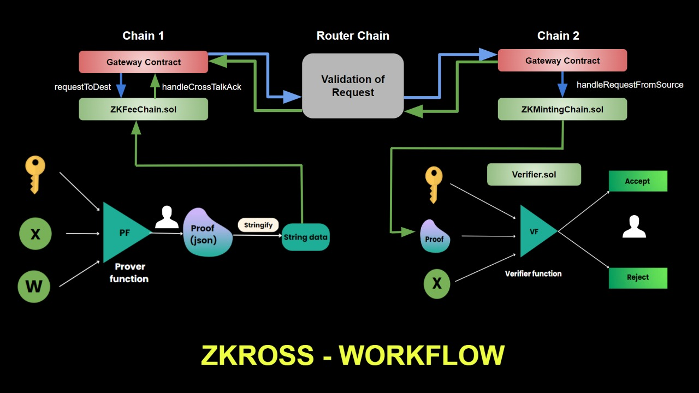

# ZKross
### Leveraging Zero-Knowledge Proofs to expand the horizons in terms of the use-cases of Cross-Chain Transactions.

### The two main aspects of this projects are: 
## 1. Cross-chain interactions
The next step in making the web decentralized is looking for a way to connect and facilitate transfer of data, which is essentially assets, across multiple chains.
<a href="https://www.routerprotocol.com/">Router Protocol</a> provides an infrastructure layer enabling communication between blockchains.
A few applications of this protocol and cross-chain data transfer in general are:   
**Fund Transfers:** Transfer assets from one chain to another. Users can send their DAI from Polygon to Fantom seamlessly. 
**Asset Swaps:** Swap asset A on-chain X for asset B on chain Y. For instance, users can swap their USDT on Ethereum for DAI on Polygon using Voyager. 
**Cross-chain Applications:** Build Dapps that enable cross-chain lending, governance, and much more across EVM and non EVM chains.

## 2. Zero-Knowledge Proofs
A zero-knowledge proof is a way of proving the validity of a statement without revealing the statement itself. The ‘prover’ is the party trying to prove a claim, while the ‘verifier’ is responsible for validating the claim.

In basic form, a zero-knowledge proof is made up of three elements: witness, challenge, and response.

a. Witness: With a zero-knowledge proof, the prover wants to prove knowledge of some hidden information. The secret information is the “witness” to the proof, and the prover's assumed knowledge of the witness establishes a set of questions that can only be answered by a party with knowledge of the information. Thus, the prover starts the proving process by randomly choosing a question, calculating the answer, and sending it to the verifier.

b. Challenge: The verifier randomly picks another question from the set and asks the prover to answer it.

c. Response: The prover accepts the question, calculates the answer, and returns it to the verifier. The prover’s response allows the verifier to check if the former really has access to the witness. To ensure the prover isn’t guessing blindly and getting the correct answers by chance, the verifier picks more questions to ask. By repeating this interaction many times, the possibility of the prover faking knowledge of the witness drops significantly until the verifier is satisfied.

ZKPs have been further developed to create Non-Interactive ZKPs, which require only one round of communication between the prover and the verifier.

### The following can be made possible across different blockchains through the use of Zero-Knowledge Proofs and Cross-Chain Technologies:

1. Anonymous payments: By baking in zero-knowledge technology into the protocol, privacy-focused blockchain networks allow nodes to validate transactions without needing to access transaction data.

2. Authentication: Zero-knowledge proofs, can simplify authentication for both platforms and users. Once a ZK-proof has been generated using public inputs and private inputs (e.g., the user's details), the user can simply present it to authenticate their identity when they need to access the service.

3. Verifiable computation: Verifiable computing allows us to outsource computation to another entity while maintaining verifiable results. The entity submits the result along with a proof verifying that the program was executed correctly.

 

### Through the use of the combination of above mentioned technologies, things like patent licensing or house renting agreements through blockchain, or even across chains can be made possible in the near future.
